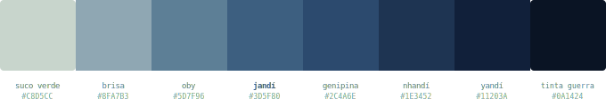

# Jandí Colors

**Uma paleta de cores derivada do pigmento azul do jenipapo (*Genipa americana*), a tinta ancestral dos povos indígenas do Brasil.**

<p align="center">
  
</p>

---

## Origem

**Jandí** vem do tupi antigo *yandï'pawa* (também grafado *nhandipab* ou *jandipab*), que significa **"fruto que serve para pintar"** — a raiz etimológica da palavra *jenipapo*.

O jenipapo (*Genipa americana*) é uma árvore nativa das florestas tropicais da América do Sul. Da polpa do fruto verde se extrai um líquido inicialmente transparente que, em contato com o ar, oxida e se transforma em uma tinta de tonalidade entre o azul profundo e o negro. Essa tinta é usada há milênios pelos povos indígenas brasileiros — Kayapó, Xavante, Asurini, Arapiun e centenas de outros — para pintura corporal em rituais, celebrações, preparação para a guerra e expressão de identidade.

### A química do azul

A substância responsável pela cor é a **genipina** (C₁₁H₁₄O₅), um iridoide presente no fruto verde. Quando a genipina entra em contato com aminoácidos (proteínas da pele, por exemplo) e é exposta ao oxigênio atmosférico, ocorre uma reação de reticulação que produz cromóforos azuis estáveis.

Esse processo é quimicamente distinto do woad europeu (*Isatis tinctoria*) e do índigo asiático (*Indigofera tinctoria*), embora todos produzam tons de azul. O jenipapo produz seu azul através de uma **rota proteica**, o que lhe confere características únicas:

- Tons claros com subtom esverdeado (genipina pré-oxidação)
- Tons médios com azul profundo e frio
- Tons escuros com densidade de tinta nanquim
- Estabilidade superior à maioria dos corantes naturais

## A paleta

8 tons derivados do comportamento real do pigmento, do suco verde pré-oxidação à tinta concentrada de pintura ritual.

| Nome | Hex | RGB | HSL | Referência |
|------|-----|-----|-----|------------|
| **Suco verde** | `#C8D5CC` | 200, 213, 204 | 138°, 13%, 81% | Polpa fresca, pré-oxidação |
| **Brisa** | `#8FA7B3` | 143, 167, 179 | 200°, 19%, 63% | Início da oxidação atmosférica |
| **Oby** | `#5D7F96` | 93, 127, 150 | 204°, 23%, 48% | Azul tupi — *oby* = azul/verde |
| **Jandí** | `#3D5F80` | 61, 95, 128 | 210°, 35%, 37% | **Cor primária** — a tinta revelada |
| **Genipina** | `#2C4A6E` | 44, 74, 110 | 213°, 43%, 30% | Índigo profundo, oxidação plena |
| **Nhandí** | `#1E3452` | 30, 52, 82 | 215°, 46%, 22% | Azul-noite, imersões múltiplas |
| **Yandí** | `#11203A` | 17, 32, 58 | 218°, 55%, 15% | Quase-preto, alta concentração |
| **Tinta de guerra** | `#0A1424` | 10, 20, 36 | 217°, 57%, 9% | Pintura ritual, concentração máxima |

### Nomenclatura

Os nomes dos tons vêm das variantes linguísticas tupi da raiz etimológica do jenipapo:

- **Oby** — palavra tupi para azul/verde (*ybac-oby* = céu azul)
- **Jandí** — recorte de *jandipab*, variante de jenipapo
- **Genipina** — o composto químico que produz o azul
- **Nhandí** — de *nhandipab*, outra variante tupi
- **Yandí** — de *yandï'pawa*, a forma mais antiga registrada

## Instalação

### npm

```bash
npm install @jandi/colors
```

```js
import { colors, jandi, oby, genipina } from '@jandi/colors'
```

### CSS

```html
<link rel="stylesheet" href="https://unpkg.com/@jandi/colors/tokens/css/jandi.css">
```

```css
.element {
  background: var(--jandi-primary);
  color: var(--jandi-suco-verde);
}
```

### Tailwind

```js
// tailwind.config.js
const { jandiColors } = require('@jandi/colors/tailwind')

module.exports = {
  theme: {
    extend: {
      colors: jandiColors
    }
  }
}
```

```html
<div class="bg-jandi-primary text-jandi-brisa">...</div>
```

### SCSS

```scss
@import '@jandi/colors/tokens/scss/jandi';

.element {
  background: $jandi-primary;
  color: $jandi-oby;
}
```

## Acessibilidade

Combinações de contraste WCAG 2.1 (ratios verificados via `cargo test --features contrast`):

| Fundo | Texto | Ratio | Nível |
|-------|-------|-------|-------|
| Suco verde | Yandí | 10.7:1 | AAA |
| Suco verde | Nhandí | 8.3:1 | AAA |
| Suco verde | Genipina | 6.0:1 | AA |
| Brisa | Tinta de guerra | 7.3:1 | AAA |
| Tinta de guerra | Suco verde | 12.2:1 | AAA |
| Tinta de guerra | Brisa | 7.3:1 | AAA |
| Brisa | Yandí | 6.5:1 | AA |
| Jandí | Suco verde | 4.4:1 | AA Large |
| Tinta de guerra | Oby | 4.3:1 | AA Large |
| Oby | Suco verde | 2.8:1 | — |

## Tokens disponíveis

```
tokens/
├── css/jandi.css              # CSS custom properties
├── scss/_jandi.scss           # SCSS variables + mixin
├── json/jandi.tokens.json     # Design Tokens (W3C format)
├── tailwind/jandi.config.js   # Tailwind plugin
├── swift/JandiColors.swift    # SwiftUI / UIKit
├── kotlin/JandiColors.kt     # Jetpack Compose / Android
└── rust/jandi.rs              # Rust const
```

## Correspondência Pantone (aproximada)

| Jandí | Pantone mais próximo |
|-------|---------------------|
| Oby #5D7F96 | PANTONE 5425 C |
| Jandí #3D5F80 | PANTONE 7700 C |
| Genipina #2C4A6E | PANTONE 534 C |
| Nhandí #1E3452 | PANTONE 289 C |

## Licença

[MIT](LICENSE) — use livremente em projetos pessoais e comerciais.

A narrativa histórica e etnobotânica é baseada em pesquisa pública. Os nomes dos tons em tupi são de domínio público linguístico.

## Créditos e referências

- Pesquisa sobre genipina: UNICAMP/Lasefi — Maria Isabel Neves, Monique Strieder, Maria Angela Meireles
- Etimologia tupi: *Vocabulário Tupi-Guarani* (5ª edição) — Silveira Bueno
- Uso indígena do jenipapo: ISA (Instituto Socioambiental), *Povos Indígenas no Brasil*
- Química da genipina: Ahmed et al. (2024), "Genipin, a natural blue colorant precursor", Food Chemistry

---

<p align="center">
  <sub>Uma paleta brasileira. Do fruto à tela.</sub>
</p>
